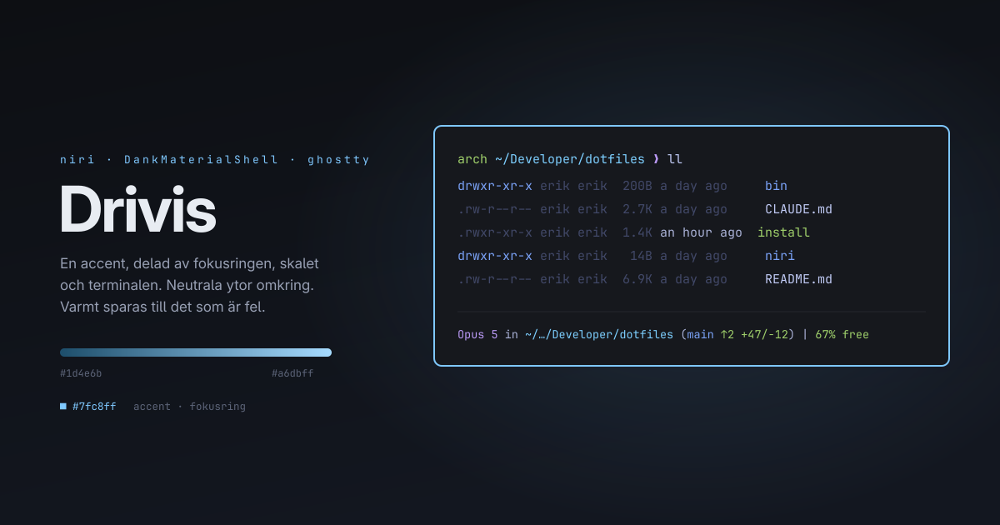

# Dotfiles



Personal configuration for Arch Linux with niri, and macOS. Managed with
[GNU Stow](https://www.gnu.org/software/stow/).

**Every visible top-level directory is a stow package**, and each one documents
itself. Anything that is not a package lives out of the way: repo assets under
`.github/`, and material kept for reference but never symlinked under
`reference/`.

| Package | | Platform |
|---|---|---|
| [bin](bin/) | Helper scripts → `~/.local/bin` | both |
| [claude](claude/) | Claude Code settings, skills, statusline | both |
| [dms](dms/) | DankMaterialShell theme + plugin lock | Linux |
| [ghostty](ghostty/) | Terminal emulator, incl. cursor shader | both |
| [lsd](lsd/) | `ls` replacement, follows the terminal palette | both |
| [niri](niri/) | Scrolling tiling compositor | Linux |
| [nvim](nvim/) | Neovim (LazyVim) + keybind cheatsheet | both |
| [spotify](spotify/) | Forces the client onto native Wayland | Linux |
| [xremap](xremap/) | `super` → `ctrl` per app, below the compositor | Linux |
| [zsh](zsh/) | Shell, prompt, aliases | both |

## Installation

```bash
sudo pacman -S stow          # or: brew install stow
git clone <repo-url> ~/Developer/dotfiles
cd ~/Developer/dotfiles
./install
```

`install` stows every package, picking the Linux-only ones by `uname`. Its
package list is deliberately explicit rather than "every directory" —
`reference/` and `.github/` sit at the top level too and must never be stowed.

Install a subset instead:

```bash
STOW_FOLDERS="nvim,zsh" ./install
```

Package READMEs are not symlinked into `$HOME`. Stow ignores top-level
`README.*` on its own — **do not add a `.stow-local-ignore` to "help" it.** A
local ignore file *replaces* stow's built-in list rather than extending it,
which is exactly how `~/KEYBINDS.md` once ended up as a symlink into this repo.

## Two machines

Nothing needs cherry-picking between them. `install` picks the Linux-only
packages by `uname`, so a niri commit landing on the Mac is just inert files in
a directory nothing reads. Pull everything, run `./install`, done.

The one thing that does fight you is lockfiles. `lazy-lock.json` and
`plugins.lock.json` are rewritten by their own tools at different times on each
machine, so they conflict without anyone having made a decision. `.gitattributes`
marks them `merge=ours` and `install` registers the driver, so each machine keeps
its own copy and the pull goes through.

Note that `enabledPlugins` in `claude/.claude/settings.json` also churns, but
that one is left alone on purpose — the other ten keys in that file are genuine
shared preferences that should propagate.

## Machine-specific config

Anything that differs per machine — monitors, resolutions, scaling, font size —
lives in `.local` files that are gitignored but sit *inside* the packages, so
stow symlinks them like everything else. The content stays local while the path
stays identical everywhere.

| File | Seeded from | Loaded by |
|---|---|---|
| `niri/.config/niri/local.kdl` | `local.kdl.example` | `include "local.kdl"` |
| `ghostty/.config/ghostty/config.local` | `config.local.example` | `config-file = ?config.local` |
| `zsh/.zshrc.local` | — | sourced if present |

`./install` copies each `.example` to its real name when missing. That matters
for niri: it refuses to start when an `include` target does not exist, so the
file has to be there before the first launch. Ghostty is relaxed — the `?`
prefix makes the include optional.

Both `.local` files load **last**, so they override whatever the tracked config
set.

## Theme

One accent, `#7fc8ff`, shared by niri's focus ring, the shell, the terminal
listing and the statusline. Surfaces are near-neutral greys on purpose: the blue
is what points, so nothing else should compete with it.

Everything that can express colour as an ANSI index does — lsd, the zsh prompt,
the Claude statusline — so they follow whatever theme Ghostty is set to instead
of pinning a second palette that drifts.

Warm colours are reserved. Yellow and red appear only when something is wrong: a
git conflict, a context window running out. Never as decoration.

## How it works

- Stow creates symlinks from this repo into `$HOME`
- Edit files **here**, not in `~/.config`
- Re-run `./install` after pulling; it unstows before stowing, so it is safe to
  repeat
